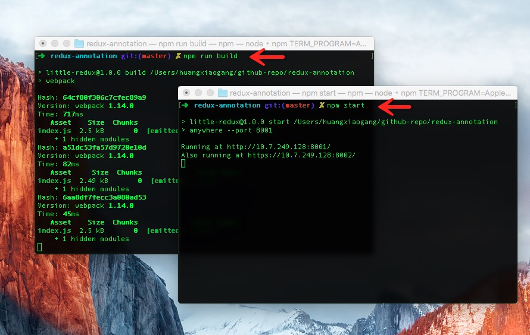

# web-bolilerplate-for-beginners

## 安装

```
  # 安装依赖
  $ npm install

```

**有以下两种方法运行项目**

### 1. 不采用devServer运行项目

```bash
  # 编译代码
  $ npm build

  # 查看效果
  $ npm start

```
### 2. 采用devServer运行项目

```bash
  # 采用webpack-dev-server编译代码
  $ npm start

```

## 使用方式

 ES6/7 :  修改src/ES6/来测试你的ES6/7语法即可

 React :  修改src/react.js来学习react代码

 Redux :  修改src/redux/来学习redux代码

 async :  修改src/async/来学习异步编程

 async/generator : 如果你想用更高级的类似async/Promise等等语法，请修改webpack.config.js

## 页面



